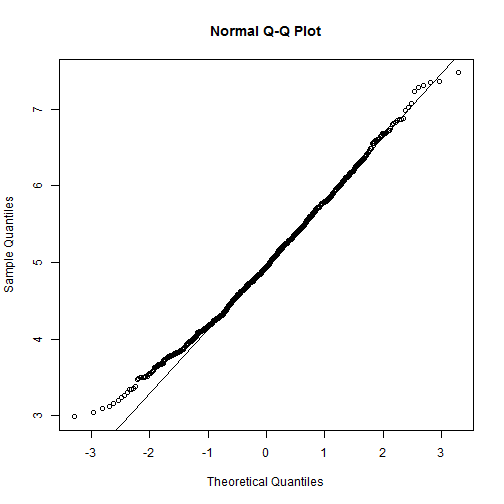

Statistical Inference- part1.pdf
========================================================
author: Radha
date: 22-11-2015

First Slide
========================================================
For more details on authoring R presentations click the
**Help** button on the toolbar.

#Plot 1
#Plot 2
#Plot 3

#Exponential distribution is simulated in R with rexp(n, lambda) where lambda $\lambda$ is the rate parameter. Average or Mean of exponential distribution is $1/\lambda$ and the standard deviation is also $1/\lambda$. For this simulation, we set $\lambda=0.2$. In this simulation, we investigate the distribution of averages of 40 numbers sampled from exponential distribution with $\lambda=0.2$.

#Now let's do a thousand simulated averages of 40 exponentials

#Slide With Code
========================================================

```r
set.seed(3)

## set variable for simulation later
lambda <- 0.2
num_sim <- 1000
sample_size <- 40
sim <- matrix(rexp(num_sim*sample_size, rate=lambda), num_sim, sample_size)
row_means <- rowMeans(sim)
## (images of plots within repo)
```


#Slide With Plot
========================================================
The distribution of sample means is below.
 

#Distribution of sample means is centered at 4.9866 and the center of the distribution is $\lambda^{-1}$ = 5. The variance of sample means is 0.6258 where the theoretical variance of the distribution is $\sigma^2 / n = 1/(\lambda^2 n) = 1/(0.04 \times 40)$ = 0.625.

#Due to the central limit theorem (CLT), the averages of samples follow normal distribution. The figure above also shows the density computed using the histogram and the normal density plotted with theoretical mean and variance values. Also, the q-q plot below suggests the normality.

 
#Finally, let's evaluate the coverage of the confidence interval for $1/\lambda = \bar{X} \pm 1.96 \frac{S}{\sqrt{n}}$

 

# 95% confidence intervals for the rate parameter ($\lambda$) to be estimated ($\hat{\lambda}$) are $\hat{\lambda}{low} = \hat{\lambda}(1 - \frac{1.96}{\sqrt{n}})$ agnd $\hat{\lambda}{upp} = \hat{\lambda}(1 + \frac{1.96}{\sqrt{n}})$. As can be seen from the plot above, for selection of $\hat{\lambda}$ around 5, the average of the sample mean falls within the confidence interval at least 95% of the time. Note that the true rate, $\lambda$ is 5.

